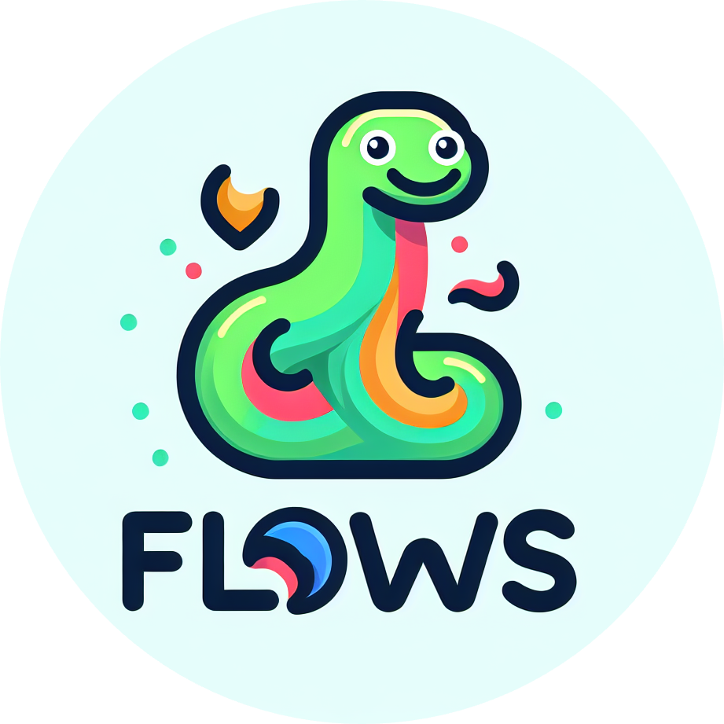
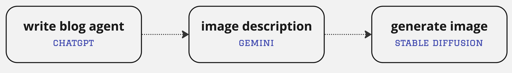
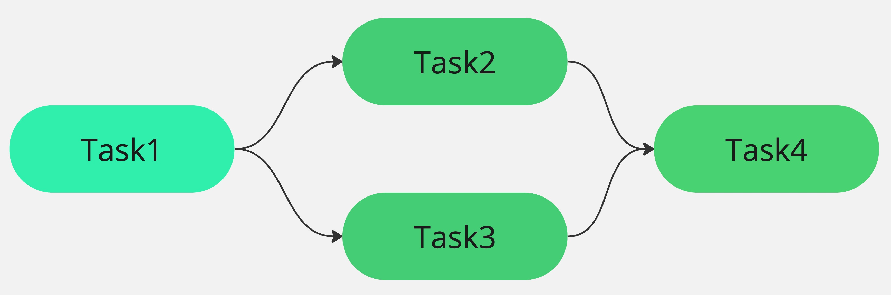

<p align="center">

</p>

<p align="center">

<a href="https://pypi.org/project/intelli/" alt="PyPI version">
    
</a>

<a href="https://discord.gg/VYgCh2p3Ww" alt="Join our Discord community">
    
</a>

</p>

# Intelli
Create chatbots and AI agent work flows. It allows to connect your data with multiple AI models like OpenAI, Gemini, and Mistral through a unified access layer.

# Install
```bash
pip install intelli
```

For detailed usage instructions, refer to the [documentation](https://doc.intellinode.ai/docs/python).

# Code Examples

## Create Chatbot
Switch between multiple chatbot providers without changing your code.

```python
from intelli.function.chatbot import Chatbot, ChatProvider
from intelli.model.input.chatbot_input import ChatModelInput

def call_chatbot(provider, model=None):
    # prepare common input 
    input = ChatModelInput("You are a helpful assistant.", model)
    input.add_user_message("What is the capital of France?")

    # creating chatbot instance
    openai_bot = Chatbot(YOUR_API_KEY, provider)
    response = openai_bot.chat(input)

    return response

# call chatGPT
call_chatbot(ChatProvider.OPENAI, "gpt-4")

# call mistralai
call_chatbot(ChatProvider.MISTRAL, "mistral-medium")

# call claude3
call_chatbot(ChatProvider.ANTHROPIC, "claude-3-sonnet-20240229")

# call google gemini
call_chatbot(ChatProvider.GEMINI)
```

## Create AI Flows
You can create a flow of tasks executed by different AI models. Here's an example of creating a blog post flow:




```python
from intelli.flow import Agent, Task, SequenceFlow, TextTaskInput, TextProcessor


# define agents
blog_agent = Agent(agent_type='text', provider='openai', mission='write blog posts', model_params={'key': YOUR_OPENAI_API_KEY, 'model': 'gpt-4'})
copy_agent = Agent(agent_type='text', provider='gemini', mission='generate description', model_params={'key': YOUR_GEMINI_API_KEY, 'model': 'gemini'})
artist_agent = Agent(agent_type='image', provider='stability', mission='generate image', model_params={'key': YOUR_STABILITY_API_KEY})

# define tasks
task1 = Task(TextTaskInput('blog post about electric cars'), blog_agent, log=True)
task2 = Task(TextTaskInput('Generate short image description for image model'), copy_agent, pre_process=TextProcessor.text_head, log=True)
task3 = Task(TextTaskInput('Generate cartoon style image'), artist_agent, log=True)

# start sequence flow
flow = SequenceFlow([task1, task2, task3], log=True)
final_result = flow.start()
```

## Graph-Based AI Flows



To build async flows with multiple paths, refer to the [flow tutorial](https://doc.intellinode.ai/docs/python/flows/async-flow).


## Connect Your Docs With Chatbot 
IntelliPy allows you to chat with your docs using multiple LLMs. To connect your data, visit the [IntelliNode App](https://app.intellinode.ai/), start a project using the Document option, upload your documents or images, and copy the generated One Key. This key will be used to connect the chatbot to your uploaded data.

```python
# creating chatbot with the intellinode one key
bot = Chatbot(YOUR_OPENAI_API_KEY, "openai", {"one_key": YOUR_ONE_KEY})

input = ChatModelInput("You are a helpful assistant.", "gpt-3.5-turbo")
input.add_user_message("What is the procedure for requesting a refund according to the user manual?")
# optional to returne the searched file name
input.attach_reference = True

response = bot.chat(input)
```

## Generate Images
Use the image controller to generate arts from multiple models with minimum code change:
```python
from intelli.controller.remote_image_model import RemoteImageModel
from intelli.model.input.image_input import ImageModelInput

# model details - change only two words to switch
provider = "openai"
model_name = "dall-e-3"

# prepare the input details
prompts = "cartoonishly-styled solitary snake logo, looping elegantly to form both the body of the python and an abstract play on data nodes."
image_input = ImageModelInput(prompt=prompt, width=1024, height=1024, model=model_name)

# call the model openai/stability
wrapper = RemoteImageModel(your_api_key, provider)
results = wrapper.generate_images(image_input)
```

## Keras Agent
Load gemma or mistral models offline using keras agent, [check the docs](https://docs.intellinode.ai/docs/python/flows/kagent).

# Repository Setup
1. Install the requirements.
```shell
pip install -r requirements.txt
```

2. Rename `.example.env` to `.env` and fill the keys.

3. Run the test cases, examples below.
```shell
# images
python3 -m unittest intelli.test.integration.test_remote_image_model

# chatbot
python3 -m unittest intelli.test.integration.test_chatbot

# mistral
python3 -m unittest intelli.test.integration.test_mistralai_wrapper

# ai flows
python3 -m unittest intelli.test.integration.test_flow_sequence
```

# Pillars
- **The wrapper layer** provides low-level access to the latest AI models.
- **The controller layer** offers a unified input to any AI model by handling the differences.
- **The function layer** provides abstract functionality that extends based on the app's use cases. 
- **Flows**: create a flow of ai agents working toward user tasks.
