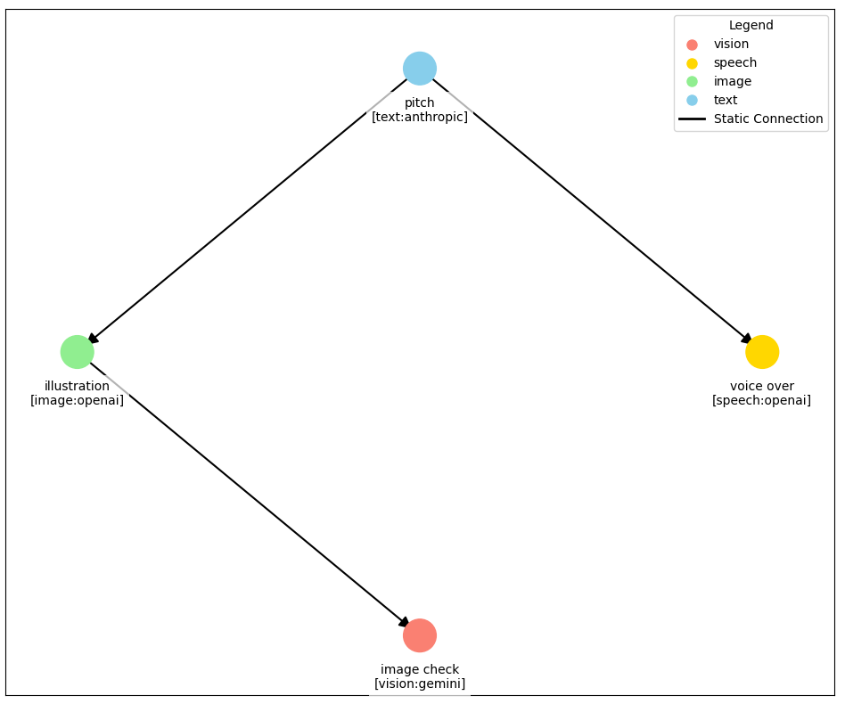

# Intelli Visual Agent Flows

Design, draw and run AI workflows that mix models and agent types, using the open source
[Intelli](https://github.com/intelligentnode/Intelli) Python library.

Ask Claude for a workflow in plain words, for example "write a product pitch with Claude, illustrate it
with OpenAI, check the image with Gemini and read the pitch aloud". Claude plans the steps, saves a picture
of the flow before any model is called, then runs it and reports what each step returned.



## What is inside

One skill, `intelli-flows`, for workflows that mix providers (OpenAI, Anthropic, Gemini, AWS Bedrock,
Mistral, local models) and agent types (assistants that can answer from documents and remember conversations,
image generation, vision, speech, transcription, embeddings, search, computer use, MCP tools). It also covers
routing, memory, templates and Vibe Agents, and the `Assistant` class for
chat apps with saved conversations, long-term memory and answers from your documents over a vector database
(Qdrant, Chroma, Weaviate, Milvus, Elasticsearch, pgvector, MongoDB Atlas, Pinecone, Firestore or Vertex AI).
Claude uses it when you ask for an AI workflow, an agent pipeline, a picture of one, or an assistant.

## What the skill does on your machine

- Install the `intelli` package from PyPI (`pip install -U "intelli[visual]"`) when it is missing.
- Write Python code that reads the API keys you set in your environment (for example `OPENAI_API_KEY`,
  `ANTHROPIC_API_KEY`, `GEMINI_API_KEY`, AWS credentials) and sends each key only to its own provider's
  API when a step runs. Keys are never written into files or printed. Drawing a flow needs no key.
- Save the flow picture and, when you ask for it, the generated images, audio and text in your project.
- For an assistant, store conversations, documents and their embeddings where you choose: local files, or a
  vector database or Firestore project you configure.
- Read the Intelli documentation index at https://www.intellinode.ai/llms.txt when an API is not covered
  by the skill.

Model calls are billed by each provider to your own account. The skill tells you before running steps
that generate images, video or audio.

## Install

From the directory: Claude, Customize, Plugins, Discover, then search for Intelli.

In Claude Code, from this repository's marketplace:

```bash
claude plugin marketplace add intelligentnode/Intelli
claude plugin install intelli-flows@intellinode
```

## License

Apache-2.0. See https://github.com/intelligentnode/Intelli/blob/main/LICENSE.
